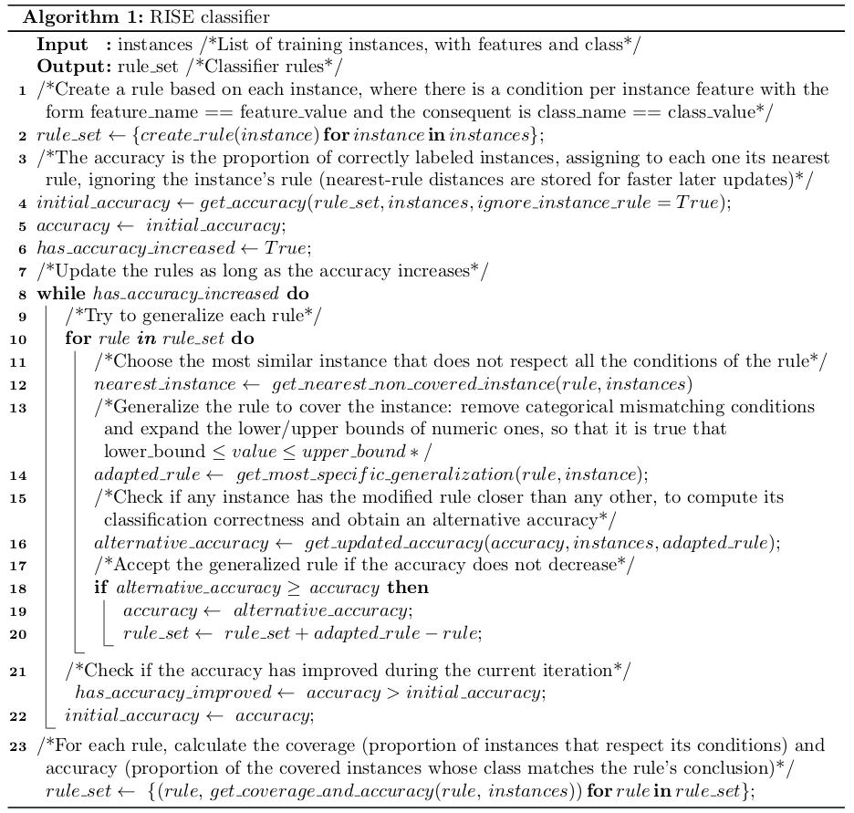

# RISE Rule-Based Classifier

The Rule Induction from a Set of Exemplars classifier (RISE) was introduced by Pedro Domingos from University of California in 1996 [1]. The most innovative feature of this algorithm is that it combines rule induction with instance-based learning, in the attempt of building a more accurate classifier than previous rule-based approaches.

The objective of this work is the and the evaluation of a custom Python implementation of RISE for classification tasks, applying it to 4 data sets of different sizes and features. The accuracy of each trained model is computed, as well as the coverage and local accuracy of each rule.

| | |
|-|-|
| **Author** | Albert Espín |
| **Date**  | March 2019  |
| **Report license**  | Creative Commons Attribution, Non-Commercial, Non-Derivative |

[1] Domingos, P. (1996). Unifying instance-based and rule-based induction. Machine Learning, 24(2), 141-168.
